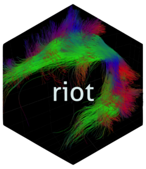

<!-- README.md is generated from README.Rmd. Please edit that file -->

# riot 

<!-- badges: start -->

[](https://github.com/astamm/riot/actions)
[](https://github.com/astamm/riot/actions)
[](https://app.codecov.io/gh/astamm/riot?branch=master)
[](https://github.com/astamm/riot/actions)
[](https://CRAN.R-project.org/package=riot)
<!-- badges: end -->

## Overview

The [**riot**](https://astamm.github.io/riot/) (R Input/Output for
Tractography) package provides an R interface for importing and
exporting tractography data to and from `R`. Currently supported
importing formats are:

- native [VTK](https://vtk.org) `.vtk` and `.vtp` files;
- [medInria](https://med.inria.fr) `.fds` files;
- [MRtrix](https://mrtrix.readthedocs.io/en/latest/getting_started/image_data.html)
  `.tck/.tsf` files; and,
- [TrackVis](http://trackvis.org/docs/?subsect=fileformat) `.trk` files.

The package reads tractography data into a
[tibble](https://tibble.tidyverse.org) in which each row is a point
characterized by at least the following five variables:

- `X`, `Y`, `Z`: 3D coordinates of the current point;
- `PointId`: Identification number of the current point among all points
  of the streamline it belongs to;
- `StreamlineId`: Identification number of the streamline which the
  current point belongs to.

The points might also have attributes or a color assigned to them, in
which case, additional variables will be properly created to import them
as well. The user can perform statistical analysis on the point cloud
and store any new variable that (s)he would deem to be useful as
additional column of the [tibble](https://tibble.tidyverse.org). The
package also allows to write back the
[tibble](https://tibble.tidyverse.org), including all newly created
attributes, into the following exporting formats:

- native [VTK](https://vtk.org) `.vtk` and `.vtp` files; or,
- [medInria](https://med.inria.fr) `.fds` files.

## Installation

You can install the released version of
[**riot**](https://astamm.github.io/riot/) from
[CRAN](https://cran.r-project.org) with:

``` r
install.packages("riot")
```

Alternatively you can install the development version of
[**riot**](https://astamm.github.io/riot/) from
[GitHub](https://github.com/) with:

``` r
# install.packages("remotes")
remotes::install_github("astamm/riot")
```

## Example

``` r
library(riot)
```

### Native [VTK](https://vtk.org) `.vtk` and `.vtp` files

``` r
uf_left_vtk  <- read_fascicles(system.file("extdata", "UF_left.vtk",  package = "riot"))
#> Number of data points: 38697
#> Number of streamlines: 2042
#> ✔ The fascicles stored in ']8;;file:///Library/Frameworks/R.framework/Versions/4.2-arm64/Resources/library/riot/extdata/UF_left.vtk/Library/Frameworks/R.framework/Versions/4.2-arm64/Resources/library/riot/extdata/UF_left.vtk]8;;' have been successfully imported.
uf_left_vtk
#> # A tibble: 38,697 × 5
#>        X     Y      Z PointId StreamlineId
#>    <dbl> <dbl>  <dbl>   <dbl>        <dbl>
#>  1  13.7 -41.8 -13.1        1            1
#>  2  13.0 -40.4 -13.9        2            1
#>  3  13.9 -37.5 -13.8        3            1
#>  4  14.3 -34.7 -12.8        4            1
#>  5  15.2 -32.7 -11.8        5            1
#>  6  14.3 -29.2 -11.3        6            1
#>  7  12.8 -25.5  -9.73       7            1
#>  8  12.4 -22.6  -9.89       8            1
#>  9  11.1 -20.0 -10.7        9            1
#> 10  12.8 -16.6 -12.8       10            1
#> # … with 38,687 more rows
```

``` r
uf_left_vtp  <- read_fascicles(system.file("extdata", "UF_left.vtp",  package = "riot"))
#> Number of data points: 38697
#> Number of streamlines: 2042
#> ✔ The fascicles stored in ']8;;file:///Library/Frameworks/R.framework/Versions/4.2-arm64/Resources/library/riot/extdata/UF_left.vtp/Library/Frameworks/R.framework/Versions/4.2-arm64/Resources/library/riot/extdata/UF_left.vtp]8;;' have been successfully imported.
uf_left_vtp
#> # A tibble: 38,697 × 5
#>        X     Y      Z PointId StreamlineId
#>    <dbl> <dbl>  <dbl>   <dbl>        <dbl>
#>  1  13.7 -41.8 -13.1        1            1
#>  2  13.0 -40.4 -13.9        2            1
#>  3  13.9 -37.5 -13.8        3            1
#>  4  14.3 -34.7 -12.8        4            1
#>  5  15.2 -32.7 -11.8        5            1
#>  6  14.3 -29.2 -11.3        6            1
#>  7  12.8 -25.5  -9.73       7            1
#>  8  12.4 -22.6  -9.89       8            1
#>  9  11.1 -20.0 -10.7        9            1
#> 10  12.8 -16.6 -12.8       10            1
#> # … with 38,687 more rows
```

### [medInria](https://med.inria.fr) `.fds` files

``` r
uf_left_fds  <- read_fascicles(system.file("extdata", "UF_left.fds",  package = "riot"))
#> Number of data points: 38697
#> Number of streamlines: 2042
#> ✔ The fascicles stored in ']8;;file:///Library/Frameworks/R.framework/Versions/4.2-arm64/Resources/library/riot/extdata/UF_left.fds/Library/Frameworks/R.framework/Versions/4.2-arm64/Resources/library/riot/extdata/UF_left.fds]8;;' have been successfully imported.
uf_left_fds
#> # A tibble: 38,697 × 5
#>        X     Y      Z PointId StreamlineId
#>    <dbl> <dbl>  <dbl>   <dbl>        <dbl>
#>  1  13.7 -41.8 -13.1        1            1
#>  2  13.0 -40.4 -13.9        2            1
#>  3  13.9 -37.5 -13.8        3            1
#>  4  14.3 -34.7 -12.8        4            1
#>  5  15.2 -32.7 -11.8        5            1
#>  6  14.3 -29.2 -11.3        6            1
#>  7  12.8 -25.5  -9.73       7            1
#>  8  12.4 -22.6  -9.89       8            1
#>  9  11.1 -20.0 -10.7        9            1
#> 10  12.8 -16.6 -12.8       10            1
#> # … with 38,687 more rows
```

### [MRtrix](https://mrtrix.readthedocs.io/en/latest/getting_started/image_data.html) `.tck/.tsf` files

``` r
af_left_tck  <- read_fascicles(system.file("extdata", "AF_left.tck",  package = "riot"))
#> ✔ The fascicles stored in ']8;;file:///Library/Frameworks/R.framework/Versions/4.2-arm64/Resources/library/riot/extdata/AF_left.tck/Library/Frameworks/R.framework/Versions/4.2-arm64/Resources/library/riot/extdata/AF_left.tck]8;;' have been successfully imported.
af_left_tck
#> # A tibble: 140,301 × 5
#>        X     Y     Z PointId StreamlineId
#>    <dbl> <dbl> <dbl>   <int>        <dbl>
#>  1 -56.1 -24.6  9.55       1            1
#>  2 -51.4 -25.0  6.49       2            1
#>  3 -49.2 -25.3  5.80       3            1
#>  4 -46.4 -25.2  5.68       4            1
#>  5 -44.5 -24.7  5.19       5            1
#>  6 -42.2 -24.3  4.06       6            1
#>  7 -40.4 -24.7  3.09       7            1
#>  8 -39.2 -25.5  2.57       8            1
#>  9 -38.4 -26.5  2.70       9            1
#> 10 -37.1 -28.6  3.84      10            1
#> # … with 140,291 more rows
```

### [TrackVis](http://trackvis.org/docs/?subsect=fileformat) `.trk` files

``` r
cc_mid_trk  <- read_fascicles(system.file("extdata", "CCMid.trk",  package = "riot"))
#> ✔ The fascicles stored in ']8;;file:///Library/Frameworks/R.framework/Versions/4.2-arm64/Resources/library/riot/extdata/CCMid.trk/Library/Frameworks/R.framework/Versions/4.2-arm64/Resources/library/riot/extdata/CCMid.trk]8;;' have been successfully imported.
cc_mid_trk
#> # A tibble: 112,675 × 5
#>        X     Y     Z PointId StreamlineId
#>    <dbl> <dbl> <dbl>   <int>        <int>
#>  1  8.66 -31.4  68.6       1            1
#>  2  8.89 -31.3  68.1       2            1
#>  3  9.11 -31.2  67.7       3            1
#>  4  9.34 -31.2  67.2       4            1
#>  5  9.56 -31.1  66.8       5            1
#>  6  9.79 -31.0  66.4       6            1
#>  7 10.0  -31.0  65.9       7            1
#>  8 10.2  -30.9  65.5       8            1
#>  9 10.5  -30.8  65.0       9            1
#> 10 10.7  -30.8  64.6      10            1
#> # … with 112,665 more rows
```

## Dependencies

The [**riot**](https://astamm.github.io/riot/) package has two
dependencies: [VTK](https://vtk.org/) and
[TinyXML-2](https://github.com/leethomason/tinyxml2). They both have
been slightly altered with respect to the original softwares for
compliance with [CRAN](https://cran.r-project.org) policy. Specifically:

- `vtk/include/utf8.h` header file has been modified to ensure LF line
  endings;
- some source files of the `CommonDataModel` and `vtkzlib` modules have
  been modified to avoid compilation warnings arising when using LLVM or
  Apple clang or GNU gcc compilers;
- `tinyxml2.cpp` has been modified to avoid the use of `stdout` and
  `printf` as per *Writing R Extensions* manual recommendations because
  `R` has its own input/output mechanism for writing to the console.

## Acknowledgements

The authors would like to thank Tim Schäfer, the author of the
[**freesurferformats**](https://CRAN.R-project.org/package=freesurferformats)
package, for his helpful code to read
[MRtrix](https://mrtrix.readthedocs.io/en/latest/getting_started/image_data.html)
and [TrackVis](http://trackvis.org/docs/?subsect=fileformat)
tractography file formats.
