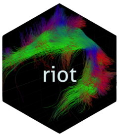

<!-- README.md is generated from README.qmd. Please edit that file -->

```{r}
#| include: false
knitr::opts_chunk$set(
  collapse = TRUE,
  comment = "#>",
  message = FALSE,
  warning = FALSE
)
```

# riot 

<!-- badges: start -->
[](https://github.com/astamm/riot/actions/workflows/R-CMD-check.yaml)
[](https://app.codecov.io/gh/astamm/riot)
[](https://CRAN.R-project.org/package=riot)
<!-- badges: end -->

## Overview

The [**riot**](https://astamm.github.io/riot/) (R Input/Output for
Tractography) package provides an R interface for importing and exporting
tractography data to and from `R`. Currently supported importing formats are:

- native [VTK](https://vtk.org) `.vtk` and `.vtp` files;
- [medInria](https://med.inria.fr) `.fds` files;
- [MRtrix](https://mrtrix.readthedocs.io/en/latest/getting_started/image_data.html)
  `.tck/.tsf` files; and,
- [TrackVis](https://trackvis.org/docs/?subsect=fileformat) `.trk` files.

The package reads tractography data into `bundle` objects (lists of
`streamline` matrices) in which each streamline is a numeric matrix with
columns `X`, `Y`, `Z` for the 3D coordinates of successive points. Points may
also carry scalar attributes (e.g. diffusion metrics) stored as additional
matrix columns.

The package also allows to write bundles back into the following exporting
formats:

- native [VTK](https://vtk.org) `.vtk` and `.vtp` files; or,
- [medInria](https://med.inria.fr) `.fds` files.

## Installation

You can install the released version of
[**riot**](https://astamm.github.io/riot/) from
[CRAN](https://cran.r-project.org) with:

```r
install.packages("riot")
```

Alternatively you can install the development version of
[**riot**](https://astamm.github.io/riot/) from [GitHub](https://github.com/)
with:

```r
# install.packages("remotes")
remotes::install_github("astamm/riot")
```

## Example

```{r riot-import}
library(riot)
```

### Native [VTK](https://vtk.org) `.vtk` and `.vtp` files

```{r vtk}
uf_left_vtk <- read_bundle(system.file(
  "extdata",
  "UF_left.vtk",
  package = "riot"
))
uf_left_vtk
```

```{r vtp}
uf_left_vtp <- read_bundle(system.file(
  "extdata",
  "UF_left.vtp",
  package = "riot"
))
uf_left_vtp
```

### [medInria](https://med.inria.fr) `.fds` files

```{r fds}
uf_left_fds <- read_bundle(system.file(
  "extdata",
  "UF_left.fds",
  package = "riot"
))
uf_left_fds
```

### [MRtrix](https://mrtrix.readthedocs.io/en/latest/getting_started/image_data.html) `.tck/.tsf` files

```{r tck}
af_left_tck <- read_bundle(system.file(
  "extdata",
  "AF_left.tck",
  package = "riot"
))
af_left_tck
```

### [TrackVis](https://trackvis.org/docs/?subsect=fileformat) `.trk` files

```{r trk}
cc_mid_trk <- read_bundle(system.file(
  "extdata",
  "CCMid.trk",
  package = "riot"
))
cc_mid_trk
```

## Dependencies

### VTK

Since version 1.2.0, **riot** delegates all VTK linkage to the
[**rvtk**](https://github.com/astamm/rvtk) infrastructure package. **VTK is
not a system requirement**: neither for **riot** nor for **rvtk**. At install
time, **rvtk** searches for a pre-installed VTK in the following order:

1. `VTK_DIR` environment variable (highest priority).
2. [Homebrew](https://brew.sh) — macOS only (`brew install vtk`).
3. `pkg-config` — macOS and Linux.
4. Well-known system prefix paths (`/usr`, `/usr/local`) — Linux.
5. Rtools42+ pacman package for the active MSYS2 environment
   (e.g. `mingw-w64-ucrt-x86_64-vtk` for UCRT64) — Windows.

If no pre-installed VTK is found, **rvtk** automatically downloads a
pre-compiled static or shared VTK build from its
[GitHub releases](https://github.com/astamm/rvtk/releases), so no manual VTK
installation is ever required.

### TinyXML-2

**riot** bundles [TinyXML-2](https://github.com/leethomason/tinyxml2).
`tinyxml2.cpp` has been modified to avoid the use of `stdout` and `printf` as
per *Writing R Extensions* manual recommendations because `R` has its own
input/output mechanism for writing to the console.

## Acknowledgements

The authors would like to thank Tim Schäfer, the author of the
[**freesurferformats**](https://CRAN.R-project.org/package=freesurferformats)
package, for his helpful code to read
[MRtrix](https://mrtrix.readthedocs.io/en/latest/getting_started/image_data.html)
and [TrackVis](https://trackvis.org/docs/?subsect=fileformat) tractography file
formats.
